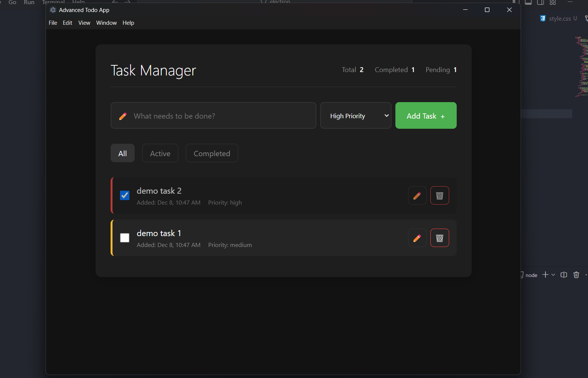

# 📝 **Advanced Todo App**

Effortlessly manage your tasks with a modern, feature-rich desktop application built on Electron.

---

## 🚀 **Features**

🎯 **Task Management at Its Best**

-   🆕 **Add Tasks**: Quickly add tasks with a priority level to keep things organized.
-   ✏️ **Edit Tasks**: Easily update tasks using a user-friendly edit modal.
-   🗑️ **Delete Tasks**: Remove tasks with a confirmation prompt for safety.

🔍 **Filter with Ease**

-   🌐 View **All Tasks** in one place.
-   ✅ Show only **Completed Tasks**.
-   🔄 Focus on **Active Tasks**.

🔥 **Prioritize Like a Pro**

-   Assign **Low**, **Medium**, or **High Priority** to tasks.

📊 **Track Your Progress**

-   View **Total Tasks**, **Completed Tasks**, and **Pending Tasks** at a glance.

💾 **Persistent Storage**

-   Your tasks are saved locally, so they stay with you even after you close the app.

---

## 🎥 **Demo**

---

## 📖 **Usage**

1. **Add a Task**

    - Enter the task description, select a priority, and click the **Add Task** button.

2. **Edit a Task**

    - Click the ✏️ **Edit Button** next to the task, update the details, and save.

3. **Delete a Task**

    - Click the 🗑️ **Delete Button** next to the task and confirm the deletion.

4. **Filter Tasks**
    - Use the filter buttons to view **All**, **Active**, or **Completed** tasks.

---

## 🛠️ **Development**

This project is powered by **Electron**, enabling seamless cross-platform functionality with modern web technologies.

### **File Structure**

-   `index.js` - Main process configuration for Electron.
-   `app.js` - Core application logic for task management.
-   `index.html` - Application UI structure.
-   `style.css` - Sleek and responsive styles for the app.
-   `preload.js` - Secure main-renderer communication.

### **Technologies Used**

-   **JavaScript**
-   **HTML5 & CSS3**
-   **Electron.js**

---

## 🌟 **Contributing**

Contributions are always welcome!

-   **Fork** the repository.
-   Create a new branch for your feature or fix.
-   Submit a **pull request** with a detailed description.

Together, let's make the Advanced Todo App even better!
